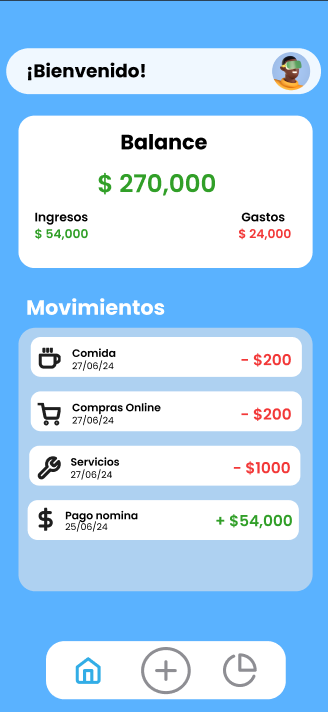
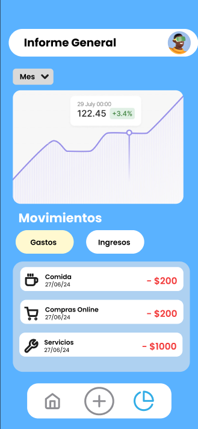

# MoneyGuard

## Descripción

MoneyGuard es una aplicación móvil desarrollada en Flutter que permite a los usuarios rastrear sus ingresos y gastos diarios, categorizarlos y analizar sus hábitos de gasto. La aplicación ofrece una interfaz intuitiva y fácil de usar, gráficos interactivos y la capacidad de exportar datos.

## Características

- **Registro de Gastos e Ingresos**: Añade y edita tus transacciones diarias.
- **Categorías Personalizables**: Clasifica tus transacciones en categorías personalizadas.
- **Gráficos Interactivos**: Visualiza tus gastos e ingresos en gráficos.
- **Exportación de Datos**: Exporta tus datos a un archivo CSV para análisis externo.

## Tecnologías Utilizadas

- Flutter
- Supabase (BackEnd)
- Dart
- Hive (para persistencia de datos)
- Provider (para gestión del estado)
- Charts_flutter (para gráficos)
- Flutter_localizations (para soporte multilenguaje)

  <h2>Imágenes de la Aplicación</h2>

    
    

